# Top 12 Business Lending Marketplace Platforms Ranked in 2025 (Complete Compilation)

Applying to individual lenders one-by-one means filling out dozens of applications, enduring multiple credit checks, and waiting weeks for approval decisions that often come back as rejections without explanation. Business lending marketplaces eliminate this inefficiency by connecting you with 20-75+ lenders through single applications, comparing rates and terms instantly, and delivering funding decisions within hours rather than weeks—often matching businesses with lenders they'd never discover independently. The right platform balances lender network size with approval speed, transparent fee structures, and specialized products spanning working capital, equipment financing, merchant cash advances, and SBA loans tailored to your specific business situation.

## **[Link to Lender](https://ai.linktolender.com)**

AI-driven marketplace automating merchant financing with white-label solutions for ISOs.

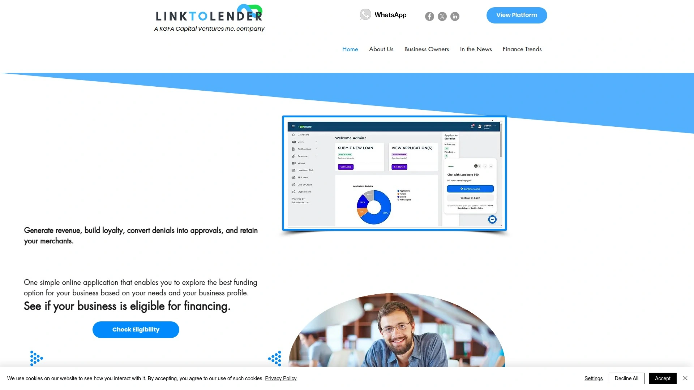

Link to Lender operates as comprehensive business financing marketplace connecting merchants with multiple funding sources through intelligent matching technology removing weeks of manual lender research. Single application unlocks access to business lines of credit, merchant cash advances, SBA loans, factoring, and equipment financing without submitting separate paperwork to each lender. Cloud-based platform centralizes all data including loan applications, financial statements, and bank records eliminating need for external storage or scattered document management.

Data aggregation acceleration simplifies customer onboarding by streamlining workflows and reducing friction points that typically slow traditional lending processes. Automated experience service delivers instant credit decisions on multiple products letting businesses compare financing options side-by-side before committing. Revenue-sharing model enables partner platforms generating income from capital extended to their merchants without assuming lending risk.

**White-label solution** for ISOs provides branded loan origination platform managing MCA deals, lines of credit, and SBA loans from unified dashboard. Built-in CRM and lender integration features enable ISOs adding their own lender networks or leveraging Link to Lender's existing partnerships. Comprehensive tracking monitors applications submitted by merchants, agents, and partners maintaining full visibility across deal pipeline.

Platform particularly benefits payment processors, vertical SaaS platforms, and ISOs wanting merchant financing capabilities without building lending infrastructure from scratch. Link to Lender excels for businesses seeking multiple funding options simultaneously while partners prioritize revenue generation through embedded finance offerings.

## **[Lendio](https://www.lendio.com)**

Leading marketplace connecting businesses with 75+ lenders through single application.

Lendio dominates marketplace lending by aggregating over 75 lenders offering comprehensive product selection spanning SBA loans, short-term financing, equipment loans, merchant cash advances, business lines of credit, and commercial real estate loans. Single application connects borrowers with dozens of potential lenders eliminating repetitive form completion across individual websites. Dedicated funding managers provide personalized guidance helping navigate offers and select optimal financing for specific business needs.

Loan amounts range from $5,000 to $2,000,000 with terms spanning 6 months to 10 years accommodating diverse business requirements from short-term working capital to long-term growth financing. Response times typically deliver same-day decisions with 15-minute application process and fast funding once approved. Customer reviews average 4.7/5 from over 21,300 TrustPilot ratings praising personalized service and loan variety.

**Match-based system** means Lendio presents offers from their network rather than allowing upfront lender selection, though this enables discovering options businesses might overlook independently. Minimum requirements include 12+ months in business, 600+ FICO score, and $8,000+ monthly revenue making it accessible even to newer companies. Platform has facilitated over $2 billion in funding across 107,000 loans since founding in 2011.

Lendio particularly benefits small businesses wanting to compare multiple loan products quickly without contacting individual lenders separately. The platform excels for borrowers prioritizing variety and personalized support over direct lending relationships.

## **[Biz2Credit](https://www.biz2credit.com)**

Technology-driven direct lender using AI algorithms prioritizing cash flow over credit scores.

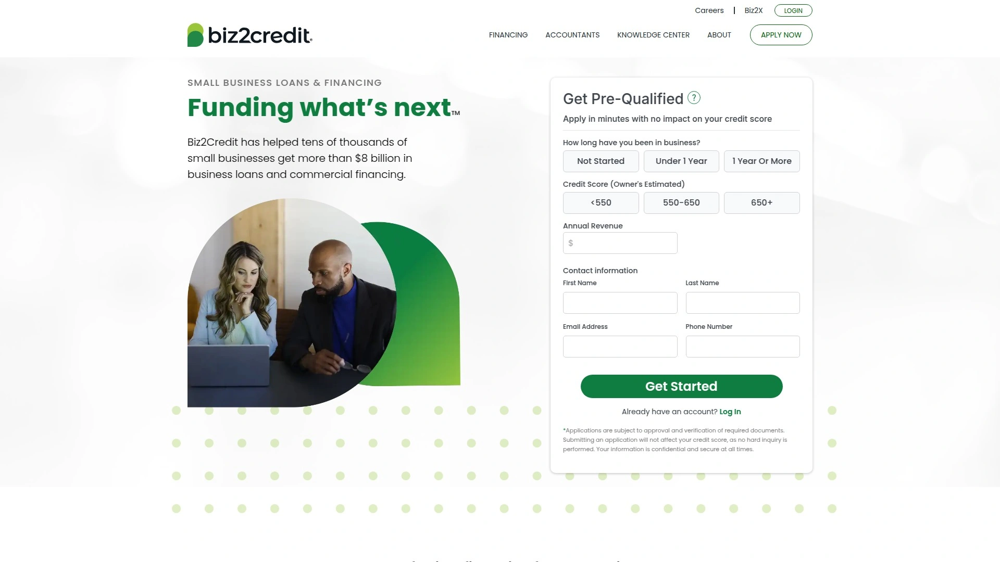

Biz2Credit operates as both marketplace and direct lender having processed over $7 billion in funding for 250,000+ businesses since 2007. Advanced algorithms evaluate applications based on overall business performance and cash flow rather than solely traditional credit scores, making it accessible to businesses that struggle with conventional bank requirements. Funding typically arrives within 72 hours of approval delivering speed critical for time-sensitive business needs.

Loan amounts range from $25,000 to $1,000,000 with terms of 12 to 36 months focusing on working capital and term loans plus commercial real estate financing for expansion. Technology-driven underwriting enables faster decisions compared to manual review processes traditional lenders require. Minimum requirements include 18+ months in business, 650+ credit score, and $250,000+ annual revenue.

**Business insights** differentiate Biz2Credit through data-driven approach revealing financial patterns and opportunities beyond simple loan approval. Customer reviews average 4.6/5 from over 15,100 TrustPilot ratings highlighting quick funding and flexible options. Pre-approval decisions arrive within minutes for qualifying applicants.

Biz2Credit particularly benefits established businesses needing substantial funding quickly without waiting weeks for traditional bank decisions. The platform excels for borrowers comfortable with algorithm-based underwriting versus relationship banking.

## **[BlueVine](https://www.bluevine.com)**

Flexible business lines of credit with same-day funding and no prepayment penalties.

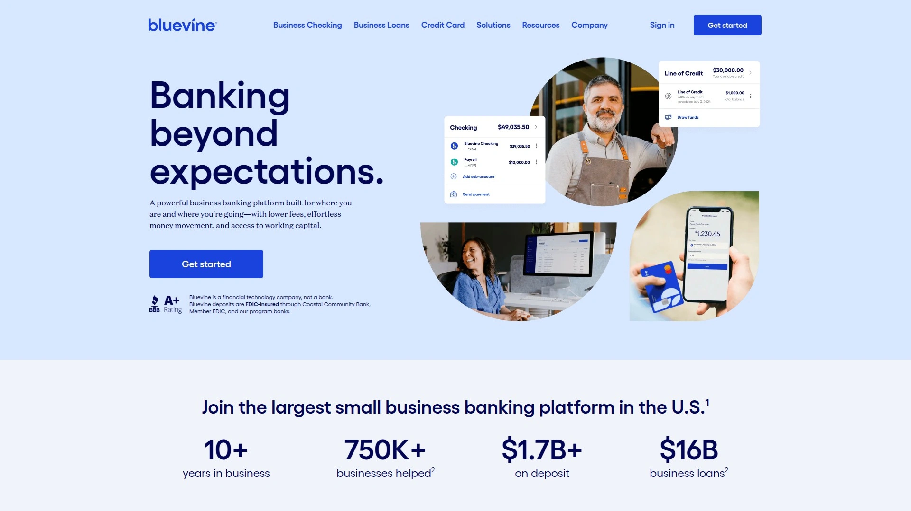

BlueVine specializes in revolving business lines of credit providing ongoing access to funds without reapplying each time capital needs arise. Draw funds as needed and pay interest only on amounts used rather than entire credit line, improving cash flow management. Same-day funding capability means approved businesses access capital within hours of approval.

Credit lines reach up to $250,000 with fast approvals often happening within minutes of application submission. No prepayment penalties enable repaying early without extra fees when cash flow improves unexpectedly. Also offers term loans and SBA loans expanding financing options beyond revolving credit.

**Fast funding focus** attracts businesses needing quick access to working capital for inventory purchases, payroll coverage, or unexpected expenses. Minimum requirements include 625+ credit score and $10,000+ monthly revenue. Customer reviews highlight convenience and transparency particularly for flexible working capital needs.

BlueVine particularly benefits businesses with fluctuating capital needs preferring draw-as-needed flexibility over fixed term loans. The platform excels for companies prioritizing speed and revolving credit access.

## **[OnDeck](https://www.ondeck.com)**

Fast-funding specialist delivering term loans and lines of credit within 24 hours.

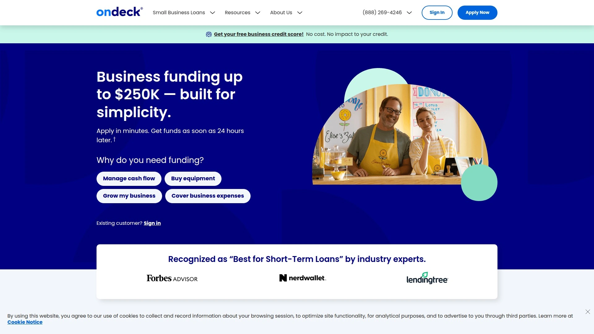

OnDeck pioneered online small business lending providing short-term loans and lines of credit typically funding within one business day. Proprietary underwriting model leverages machine learning analyzing patterns traditional lenders miss, enabling faster risk assessment. Simple application requires minimal paperwork compared to traditional bank loan processes.

Loan amounts reach up to $250,000 with terms typically 24 months or less suited for short-term working capital needs. Prepayment benefits and loyalty programs reward customers for early repayment and repeat borrowing. Minimum requirements include 625+ credit score and consistent revenue demonstrating repayment capacity.

**Speed emphasis** makes OnDeck ideal for covering unexpected expenses or bridging temporary cash flow gaps when timing matters. Higher interest rates versus traditional loans reflect short repayment terms and fast funding convenience. Mixed-to-positive customer sentiment praises speed while noting cost considerations.

OnDeck particularly benefits entrepreneurs needing fast cash without lengthy application processes especially for short-term working capital. The platform excels when speed outweighs interest rate concerns.

## **[Fundbox](https://www.fundbox.com)**

Low-credit-requirement platform providing lines of credit starting at 600 credit score.

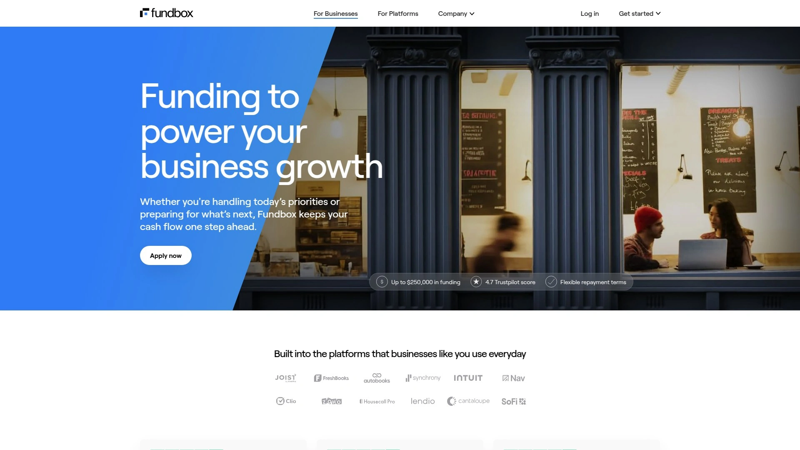

Fundbox focuses on helping newer and credit-challenged businesses access quick funding through lines of credit and short-term loans. Accepts credit scores as low as 600 lowering barriers versus competitors requiring 650+ scores. Approvals happen in minutes with minimal paperwork and automated decision-making.

Transparent pricing displays weekly repayment amounts and clear fee structures upfront preventing surprise charges. Integration with Stripe allows Stripe customers accessing lines of credit directly from their dashboard. Reporting payment activity to commercial credit bureaus through Small Business Financial Exchange helps strengthen business credit profiles.

**Quick application** delivers approval and funding as soon as next business day for qualifying applicants. Weekly repayment structure (0.4% - 0.7% of original draw amount per week) means higher frequency than monthly payments though shorter overall terms. Customer reviews highlight easy process and quick access to working capital.

Fundbox particularly benefits small businesses needing fast funding without meeting strict credit or documentation requirements traditional lenders demand. The platform excels for businesses building credit while accessing growth capital.

## **[Credibly](https://www.credibly.com)**

Fast business financing platform delivering approvals in 2 hours and funding in 4 hours.

Credibly delivers exceptional speed reviewing applications in under two hours with many receiving decisions faster. Once approved, funds transfer directly to business accounts with many businesses using capital within 4 hours of approval. Flexible financing built specifically for time-sensitive expenses, payroll coverage, or taking on new work opportunities.

Merchant cash advances and business loans range from $5,000 to $600,000 accommodating various business sizes. Full-service direct lending means Credibly handles entire underwriting, funding, and servicing process without third-party intermediaries. Over $2 billion funded to small and medium businesses across all 50 states since inception.

**Speed focus** addresses urgent business needs where waiting days or weeks for traditional approvals costs revenue opportunities. Partner portal and offer calculator provide transparency for businesses comparing financing options. Product suite flexibility spans entire credit spectrum giving more approval options.

Credibly particularly benefits businesses facing immediate cash flow needs requiring same-day funding. The platform excels when speed trumps finding absolute lowest rates.

## **[Funding Circle](https://www.fundingcircle.com)**

Peer-to-peer lending platform connecting borrowers with institutional investors.

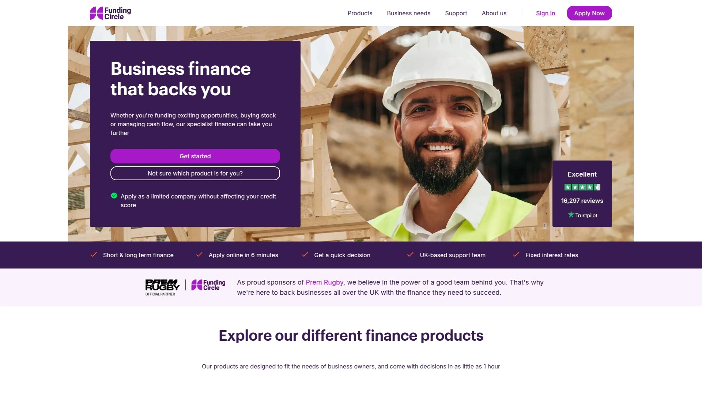

Funding Circle pioneered connecting qualified small businesses directly with institutional investors through peer-to-peer lending model. Term loans, lines of credit, and SBA 7(a) loans provide comprehensive financing options. SBA loan applicants can receive funds as quickly as 13 days after finalizing applications versus traditional 60+ day SBA timelines.

Competitive rates through investor-funded model often beat traditional bank pricing while maintaining faster approval processes. Online application streamlines borrowing process eliminating branch visits and paper-heavy processes. Established platform with years of track record funding thousands of small businesses.

**Institutional backing** provides capital stability versus platforms dependent on individual lender relationships. Focus on creditworthy borrowers means higher approval standards than some alternative lenders though better rates justify stricter requirements. Platform particularly benefits businesses comfortable with non-traditional lending sources seeking competitive rates.

Funding Circle excels for creditworthy businesses wanting institutional-backed financing without traditional bank bureaucracy.

## **[Rapid Finance](https://www.rapidfinance.com)**

Flexible financing provider offering up to $500,000 with maximum 5-year terms.

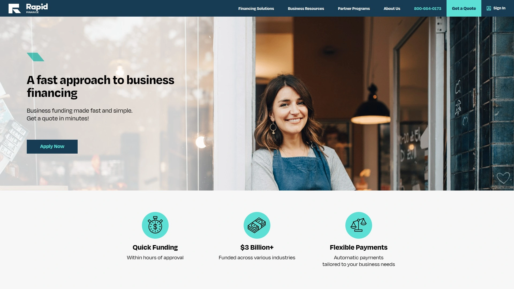

Rapid Finance provides range of financing options up to $500,000 with repayment terms reaching 5 years among longest available from online lenders. Flexible structures accommodate diverse business needs from short-term working capital to longer-term growth investments. Fast approval process typical of online lenders while offering term lengths approaching traditional bank loans.

Multiple product options ensure businesses finding appropriate financing matching their cash flow and growth plans. Online application and digital document submission eliminate in-person meetings and paper processes. Focus on small business needs with products specifically designed for SMB scenarios versus enterprise lending.

**Long-term options** differentiate Rapid Finance from competitors capping terms at 12-24 months, reducing monthly payment pressure. Particularly strong for businesses needing substantial capital with longer repayment horizons for major investments. Customer service emphasis helps borrowers navigate product selection and application process.

Rapid Finance particularly benefits businesses wanting online lending speed with traditional loan term lengths. The platform excels for substantial investments requiring extended repayment periods.

## **[iBusiness Funding](https://ibusinessfunding.com)**

Technology-enabled lending platform supporting loans from $10,000 to $25 million.

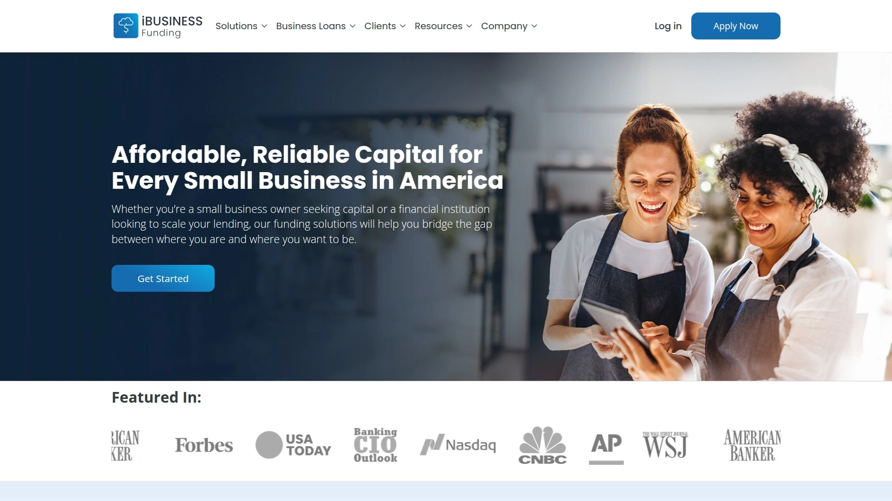

iBusiness Funding provides comprehensive lending solutions spanning small business loans to substantial growth capital through LenderAI platform. Loan range from $10,000 to $25 million accommodates businesses from startups to established enterprises requiring significant capital. Advanced technology streamlines lending process making it quicker and more efficient for both lenders and borrowers.

Tailored solutions meet unique needs of small business owners, banks, credit unions, large corporations, and alternative lenders. Data-driven decision tools provide sophisticated analytics and risk assessment supporting informed choices. Seamless user experience from application through approval respects time and priorities.

**Lending-as-a-Service model** enables financial institutions and partners launching lending programs without building infrastructure from scratch. Technology platform powers both direct lending and white-label solutions. Wide loan range ensures most business financing needs covered within single platform relationship.

iBusiness Funding particularly benefits businesses seeking substantial capital and financial institutions wanting lending technology. The platform excels for large-scale financing needs and partner enablement.

## **[NAV](https://www.nav.com)**

Credit monitoring platform with business loan marketplace and credit-building tools.

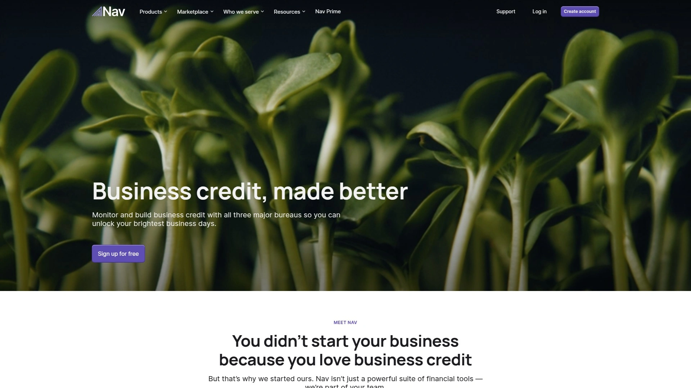

NAV combines business credit monitoring with loan marketplace access providing dual value of credit improvement and financing. Free plan includes basic credit monitoring tools tracking business credit scores and identifying improvement opportunities. Marketplace connects businesses with multiple lenders once credit profile reaches financing thresholds.

Credit-building focus helps businesses improve scores before and during borrowing journey strengthening future financing terms. Educational resources explain business credit importance and strategies for building strong profiles. Integration between credit monitoring and loan marketplace creates seamless experience from preparation through funding.

**Credit emphasis** differentiates NAV from pure lending marketplaces by addressing underlying creditworthiness alongside funding access. Annual business credit monitoring costs $199 providing ongoing visibility versus one-time loan marketplace access. Platform particularly benefits businesses wanting to understand and improve credit profiles while exploring financing.

NAV excels for credit-conscious businesses prioritizing long-term financial health alongside immediate funding needs.

## **[Fundera](https://www.fundera.com)**

NerdWallet-owned marketplace simplifying business loan comparison shopping.

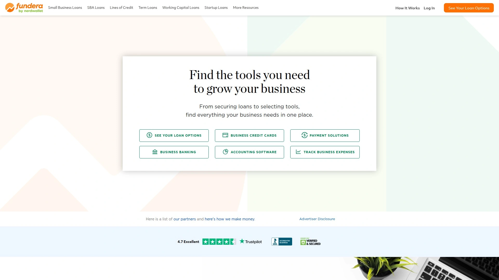

Fundera streamlines business financing through marketplace connecting borrowers with various lenders spanning short-term loans, equipment financing, invoice factoring, business lines of credit, merchant cash advances, and SBA loans. Seven-question initial form quickly identifies potential financing matches based on business profile. Displays likely funding options though not necessarily pre-qualified requiring deeper application for firm offers.

Broad range of loan products ensures most businesses finding relevant options regardless of specific needs. Simplified application process reduces time investment versus applying individually to multiple lenders. NerdWallet ownership provides established brand trust and editorial oversight.

**Marketplace model** means Fundera presents lender options rather than providing direct lending, earning fees from successful loan placements. Platform particularly benefits businesses wanting to comparison shop quickly across multiple loan types and lenders. Easy loan comparison makes it simple for business buyers and owners evaluating multiple options.

Fundera excels for borrowers prioritizing variety and ease of comparison over direct lender relationships.

## **[United Capital Source](https://www.unitedcapitalsource.com)**

Lending resource hub providing lender reviews and financing education.

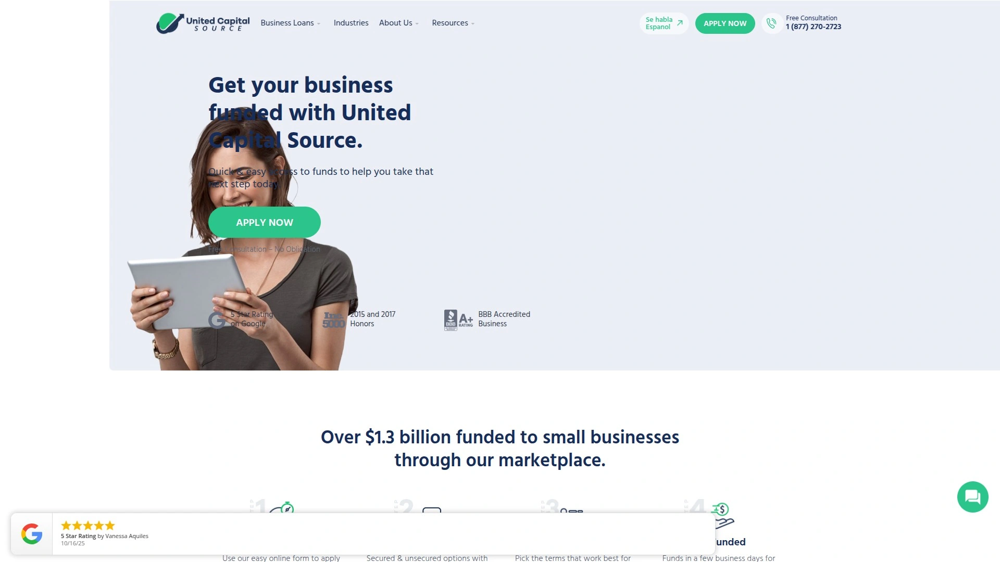

United Capital Source operates as comprehensive resource helping businesses understand lending landscape through detailed lender reviews and educational content. Reviews cover top business lenders enabling informed decision-making before applying. Educational approach helps business owners understanding financing options, terms, and application requirements.

Lender comparison tools enable evaluating multiple providers based on products, requirements, and customer experiences. Resource library addresses alternative financing methods beyond traditional loans including crowdfunding, invoice factoring, and merchant cash advances. Updated regularly ensuring information remains current as lending landscape evolves.

**Educational focus** serves businesses wanting to understand options before committing to applications. Unbiased reviews help identifying strengths and weaknesses across lender landscape. Platform particularly benefits first-time borrowers navigating business financing for the first time.

United Capital Source excels as research starting point before engaging with specific lenders or marketplaces.

## FAQ

**How do business lending marketplaces make money if applications are free?**
Marketplaces typically earn fees from lenders when successfully matching borrowers with funded loans, similar to how mortgage brokers operate—the lender pays the marketplace a placement fee once the loan closes. This means borrowers don't pay direct fees to use marketplace services, though individual loan products carry their own interest rates and origination fees set by lenders. Some platforms like Lendio explicitly state they don't charge borrowers directly, instead earning from lender relationships.

**Will applying through a marketplace hurt my credit score?**
Most marketplaces use soft credit pulls during initial applications that don't impact your credit score, only performing hard pulls once you select a specific lender and move forward with formal application. This allows comparing multiple lender offers without credit score damage versus applying directly to 5-10 individual lenders triggering multiple hard inquiries. Always verify the marketplace's credit pull policy before submitting sensitive information.

**Can I negotiate better terms with lenders found through marketplaces?**
Generally no—marketplace lenders present their standard offers based on your financial profile, and negotiation opportunities are limited since pricing is algorithmically determined. However, some marketplaces like Lendio provide funding managers who advocate on your behalf, potentially securing better terms through their lender relationships. Your best leverage comes from comparing multiple offers and choosing the most favorable terms rather than negotiating individual offers.

## Access Multiple Lenders Through Single Application

Business lending marketplaces eliminate repetitive applications across individual lenders by connecting you with 20-75+ funding sources through unified submissions, delivering instant rate comparisons and funding decisions within hours versus weeks traditional banks require. [Link to Lender](https://ai.linktolender.com) excels for merchants and ISOs seeking comprehensive financing marketplace with AI-driven matching, white-label deployment options, and built-in CRM managing everything from merchant cash advances to SBA loans while generating revenue through embedded finance without assuming lending risk. Choose platforms matching your priorities whether credit building, speed, loan variety, or technology enablement, then let marketplace efficiency accelerate your funding journey.
